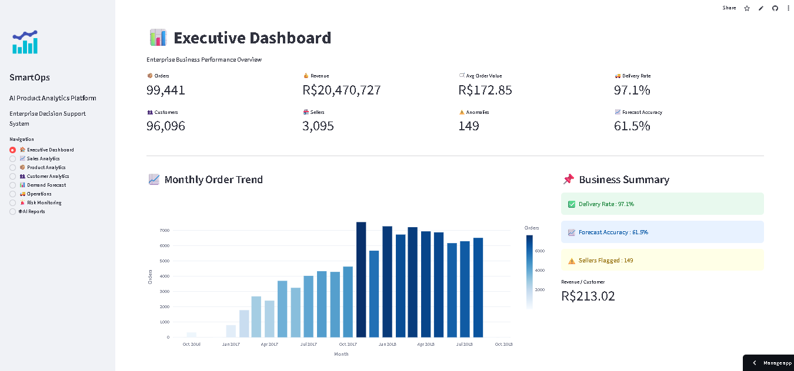
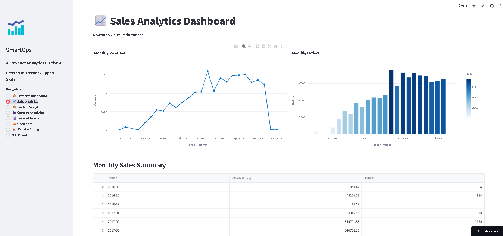
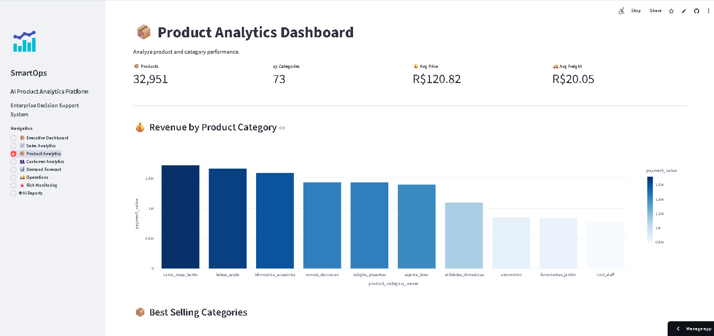
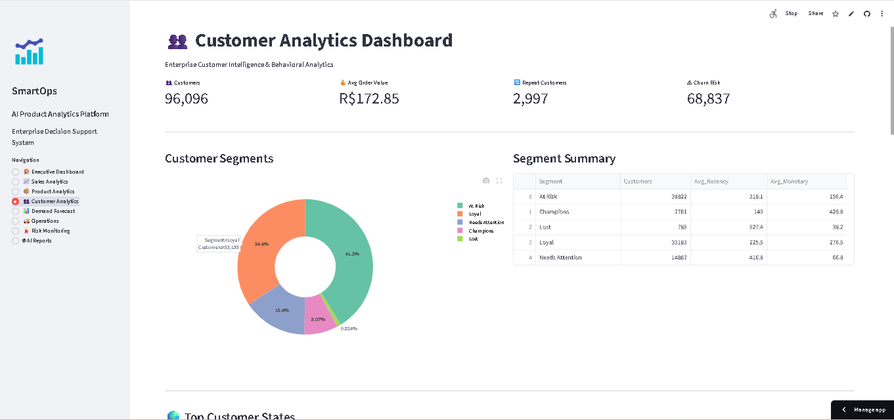
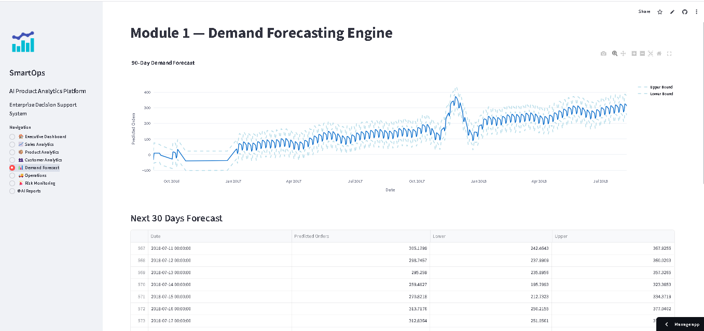
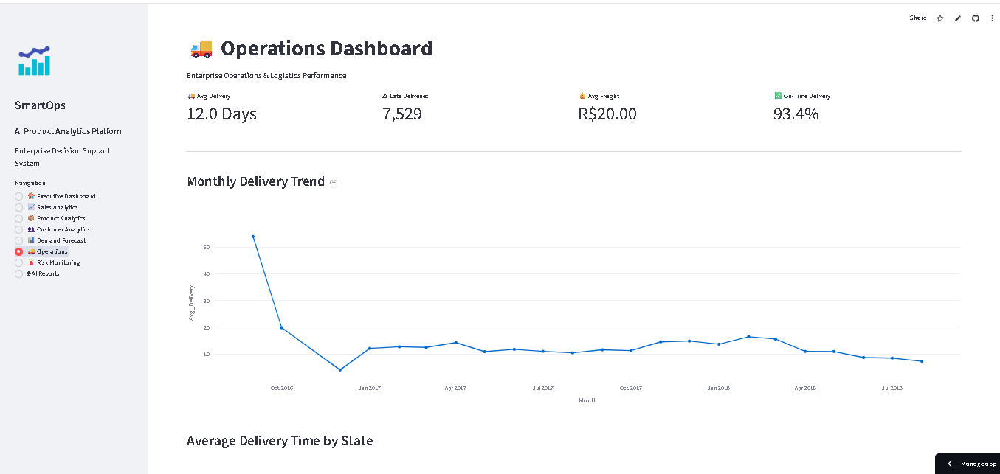
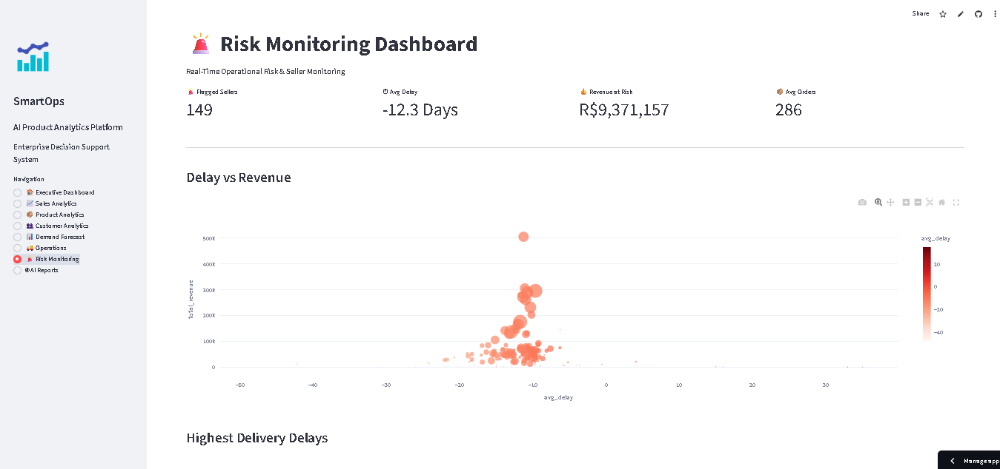
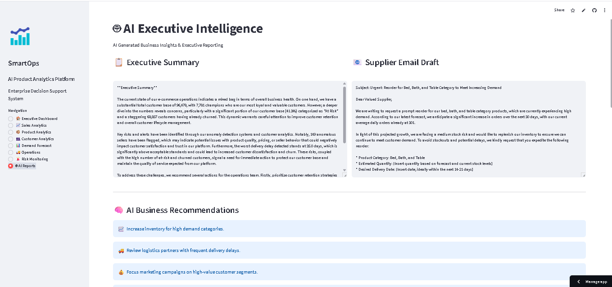

# 📊 SmartOps Enterprise

### AI-Powered Product Analytics & Operations Intelligence Platform

An enterprise-grade analytics platform that transforms raw e-commerce data into actionable business insights using Machine Learning, Business Intelligence, and AI-generated executive reporting.

---

## 🚀 Live Demo

🔗 **Streamlit App:** https://ai-powered-e-commerce-operations-intelligence-system-mduwnk3ul.streamlit.app/

## 💻 GitHub Repository

🔗 https://github.com/shagunmishra02/AI-Powered-E-Commerce-Operations-Intelligence-System/tree/main/data/Processed
---

# 📖 Overview

SmartOps Enterprise is an end-to-end AI-powered analytics platform built for e-commerce operations. It helps business teams monitor sales, forecast demand, analyze customer behavior, detect operational risks, and generate executive reports through an interactive Streamlit dashboard.

The project combines Business Intelligence dashboards, Machine Learning models, and AI-generated insights into a single enterprise decision-support platform.

---

# 🎯 Business Problem

E-commerce companies generate large amounts of operational data across customers, products, orders, sellers, and logistics.

Without centralized analytics, businesses struggle to:

- Forecast future demand
- Monitor sales performance
- Understand customer behavior
- Detect operational anomalies
- Identify high-risk sellers
- Generate executive reports quickly

SmartOps Enterprise solves these challenges through AI-powered analytics.

---

# ✨ Features

### 📊 Executive Dashboard

- Enterprise KPI Dashboard
- Revenue Monitoring
- Order Analytics
- Delivery Performance
- Customer Overview
- Business Summary Cards

---

### 📈 Sales Analytics

- Monthly Revenue Trend
- Sales Performance
- Order Volume Analysis
- Revenue Dashboard
- Sales Summary

---

### 📦 Product Analytics

- Product Performance
- Category Revenue
- Best Selling Products
- Product Distribution
- Product KPIs

---

### 👥 Customer Analytics

- RFM Customer Segmentation
- Customer Distribution
- Top Customer States
- Top Cities
- Spending Distribution
- Repeat Customer Analysis

---

### 📉 Demand Forecasting

- Prophet Forecasting Model
- 90-Day Demand Prediction
- Forecast Confidence Interval
- Interactive Forecast Dashboard

---

### 🚚 Operations Dashboard

- Delivery Performance
- Average Delivery Time
- Freight Analysis
- Logistics KPIs
- Seller Performance
- Operations Monitoring

---

### 🚨 Risk Monitoring

- Seller Anomaly Detection
- Operational Risk Dashboard
- Revenue at Risk
- Delay Analysis
- High-Risk Seller Monitoring

---

### 🤖 AI Executive Reporting

- AI Generated Weekly Reports
- Supplier Email Draft Generation
- Executive Business Summary
- Downloadable Reports
- AI Recommendations

---

# 🧠 Machine Learning Models

## Demand Forecasting

**Model**
- Prophet

Purpose:
- Predict future order demand
- Support inventory planning

---

## Customer Segmentation

**Technique**
- RFM Analysis

Metrics:
- Recency
- Frequency
- Monetary Value

Purpose:
- Customer Behaviour Analysis
- Marketing Segmentation

---

## Seller Risk Detection

**Model**
- Isolation Forest

Purpose:
- Detect abnormal seller behaviour
- Identify operational risks

---

# 📊 Dashboard Modules

| Module | Description |
|---------|-------------|
| Executive Dashboard | Enterprise KPI Overview |
| Sales Analytics | Revenue & Sales Insights |
| Product Analytics | Product Performance |
| Customer Analytics | Customer Intelligence |
| Demand Forecast | Future Demand Prediction |
| Operations | Logistics Monitoring |
| Risk Monitoring | Seller Anomaly Detection |
| AI Reports | Executive Reporting |

---

# 🏗 Project Architecture

```
Raw E-Commerce Dataset
          │
          ▼
Data Cleaning & Processing
          │
          ▼
Feature Engineering
          │
          ▼
Machine Learning Models
 ├── Prophet
 ├── RFM Segmentation
 └── Isolation Forest
          │
          ▼
AI Report Generation
          │
          ▼
Interactive Streamlit Dashboard
```

---

# 📁 Project Structure

```
AI-Powered-E-Commerce-Operations-Intelligence-System/

│
├── dashboard/
│   └── app.py
│
├── data/
│   ├── raw/
│   └── Processed/
│
├── notebooks/
│   ├── 01_EDA.ipynb
│   ├── 02_module1_demand.ipynb
│   ├── 03_module2_customer.ipynb
│   ├── 04_module3_anomaly.ipynb
│   └── 05_module4_ai_report.ipynb
│
├── outputs/
│
├── requirements.txt
│
└── README.md
```

---

# 🛠 Tech Stack

### Programming

- Python

### Data Processing

- Pandas
- NumPy

### Visualization

- Plotly
- Streamlit

### Machine Learning

- Prophet
- Scikit-learn

### AI

- Groq API

### Development

- Git
- GitHub
- VS Code

---

# 📊 Project Metrics

- 📦 Orders Analyzed: **99,441**
- 💰 Revenue Processed: **R$20.47M**
- 👥 Customers: **99,441**
- 🏪 Sellers Monitored: **3,095**
- 🚨 Operational Anomalies Detected: **149**
- 📈 Forecast Accuracy: **61.5%**
- 🚚 Delivery Rate: **97.1%**

---

# 💼 Business Value

SmartOps Enterprise enables businesses to:

- Improve inventory planning
- Forecast future demand
- Monitor customer behaviour
- Detect risky sellers
- Optimize logistics
- Support executive decision making
- Generate AI-powered business reports

---

# ▶️ Installation

Clone the repository

```bash
git clone https://github.com/shagunmishra02/AI-Powered-E-Commerce-Operations-Intelligence-System.git
```

Move into the project

```bash
cd AI-Powered-E-Commerce-Operations-Intelligence-System
```

Install dependencies

```bash
pip install -r requirements.txt
```

Run the application

```bash
cd dashboard
streamlit run app.py
```

---

# Dashboard Preview

## Executive Dashboard



---

## Sales Analytics



---

## Product Analytics



---

## Customer Analytics



---

## Demand Forecast



---

## Operations Dashboard



---

## Risk Monitoring



---

## AI Reports



---

# 🚀 Future Improvements

- Real-time data streaming
- Role-based authentication
- Cloud database integration
- Automated report scheduling
- Email notification workflow
- Interactive drill-down analytics
- REST API integration

---

# 👩‍💻 Author

**Shagun Mishra**

Computer Science Engineering Student
Mody University of Science and Technology

GitHub: https://github.com/shagunmishra02

---

## ⭐ If you found this project useful, consider giving it a star!